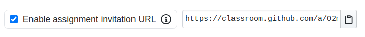

# Создание проекта в github classroom

Для возможности автоматически создавать репозитрии для учащегося нам необходимо создать `assignment` в `github classroom`

Каждый курс с проектами имеет свой `classroom`
В нем находятся все `assignment`, это название урока.
Перейдите на страницу [github classroom](https://classroom.github.com/classrooms)

Если в списке классов, нет названия вашего курса. Создайте его.  
Нажмите на вкладку для создания нового `classroom`

Выбираем `alem-classroom`. В этом репозитории будут находится все `template`.

Далее, вводим название курса. Его можно узнать из файла `.config` вашего курса. 
Параметр `name`

Теперь создаем `assignment`

`Title` должен быть в формате:  
`[lesson-name]-[course-name]-task`  
Пример: `01-intro-js-intro-task` 
Все параметры можно получить в репозитории курса

Нам нужно выбрать ранее подготовленный `template` в котором есть тестовый файл и директория `.github`.  
Подробнее в [create-template.md](./create-template.md)  
Выбор IDE опционален.

Добавляем ссылку в `readme.md` нашего урока.
И добавляем параметр `type` со значением `project` для урока курса.

