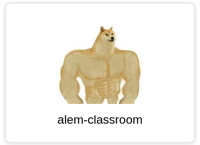
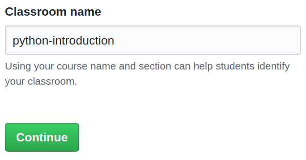
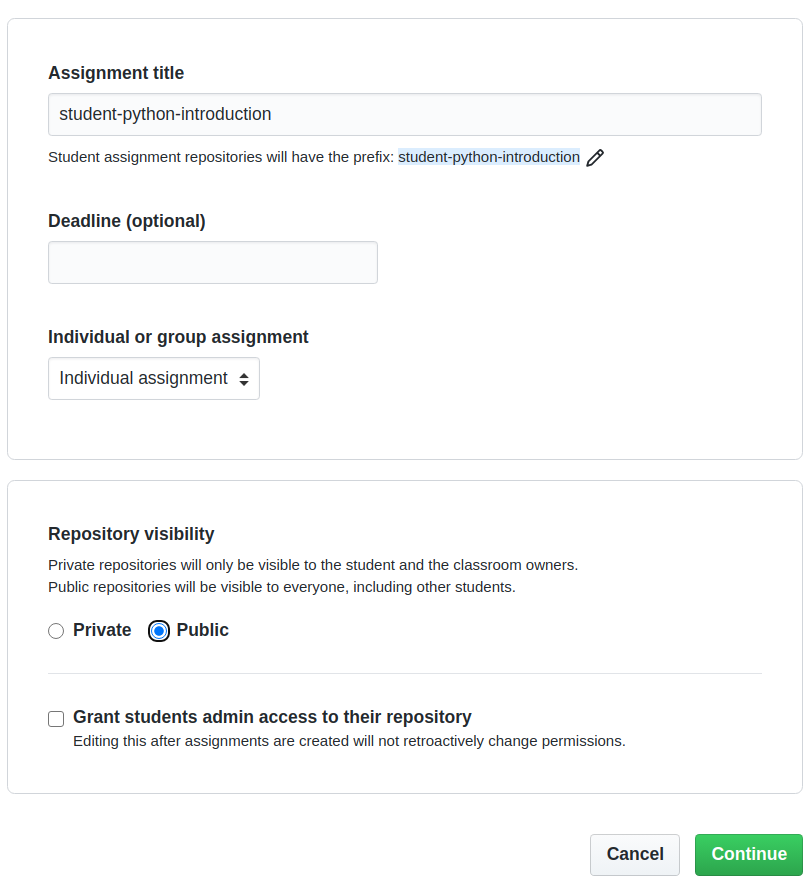

# Создание проекта в github classroom

Для возможности автоматически создавать репозитрии для учащегося нам необходимо создать `assignment` в `github classroom`

Каждый курс имеет свой `classroom`
В нем находятся `assignment` c сигнатурой `student-${course_name}`.
> Пример для python-introduction: \
> `student-python-introduction`

Перейдите на страницу [github classroom](https://classroom.github.com/classrooms)

Если в списке классов, нет названия вашего курса. Создайте его.  
Нажмите на кнопку для создания нового `classroom`

Выбираем `alem-classroom`. В этой организации будут находится все `template` и `test`.

Далее, вводим название курса. Его можно узнать из файла `.config` вашего курса. 
Параметр `name`

Теперь создаем `assignment`

`Title` должен быть в формате:  
`student-[course-name]`  

Нам нужно выбрать ранее подготовленный `template` в котором есть файл c функциями и директория `.github`.  
Подробнее в [create-template.md](./create-template.md)  
Выбор IDE опционален.

Добавляем ссылку в `readme.md` нашего урока.
И добавляем параметр `type` со значением `project` для урока курса.

